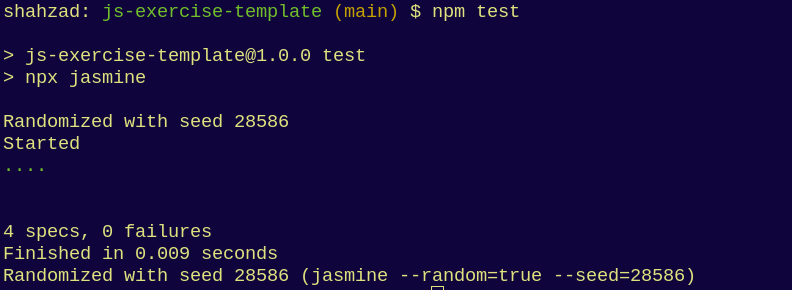

# Programming Fundamentals: Primitive Data Types

## TODO: Template updates - then delete this section

- [ ] Add optional Extensions `src` and `spec` files
  - Add in correct `extensions` sub-directories. See also `--config=...` in `package.json "scripts"` and `spec/support`
- [ ] Fill in details below!

## Learning Objectives

- Introduction to the following Javascript Primitive Data Types
  - [MDN - Javascript Primitive values](https://developer.mozilla.org/en-US/docs/Web/JavaScript/Data_structures#primitive_values)
  - Number
  - String
  - *Optionally*
    - Boolean
    - Null
    - Undefined

## Introduction

In this exercise you will learn how to manipulate the Javascript Number and String data types

## Setup

- Fork this repository and clone your forked version to your machine
- Install dependencies by running the command below while in the project's root directory:

    `npm ci`

## Instructions

- Read through the numbered comments in the following files to understand the requirements of this exercise.
  - `src/<file>.js`

- Write your code directly below the numbered comment.

- Add `console.log()`s to get visibility on your solution and run the file with the command `node src/<file>.js` *etc*

- See `src/example.js` for some examples

## Running tests

- To verify your solutions, run the test suite by running the `npx jasmine` command followed by the path to the corresponding test file for each `src/*.js` file above, eg:

    `npx jasmine spec/<file>.spec.js`

- Alternatively, run `npm test`

- To begin with, almost all of the tests will fail - example tests, if they exist, will pass with a green `.` You'll see a number of red `F`s in your console (possibly many), similar to the image below:

  

- Your solution is complete when the all the red `F`s have been replaced with green `.`s in your console, as shown below:

  

## Extensions

- Extension exercises can be found in the `src/extensions` directory with corresponding tests in the `spec/extensions` directory.

- Follow the instructions in the following files to complete the extensions.

- To run the tests for the extensions, you can either run spec files individually as follows:

  `npx jasmine extensions/<file>.spec.js`

- Alternatively, run `npm run test-extensions`
